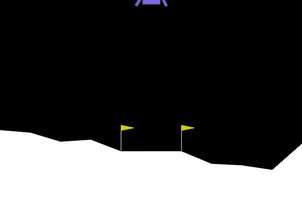
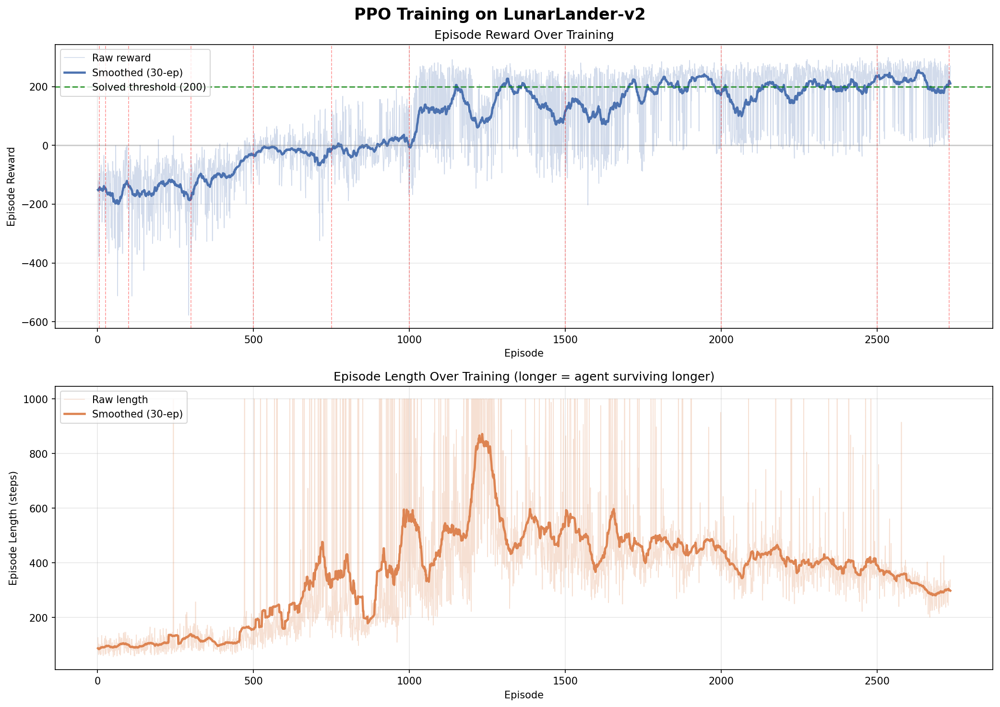
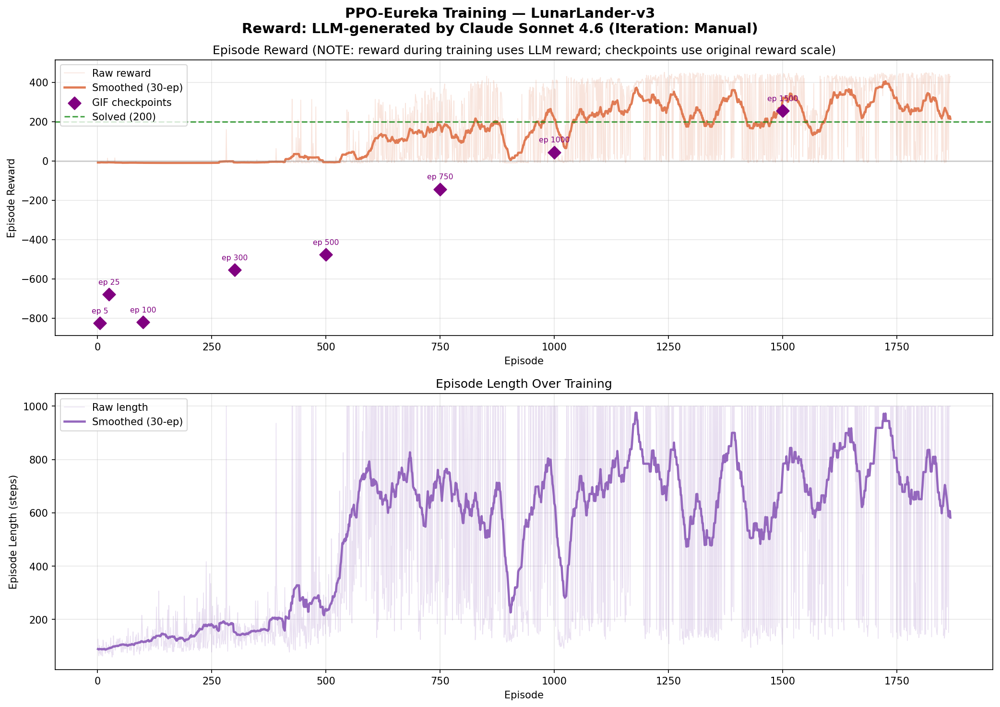
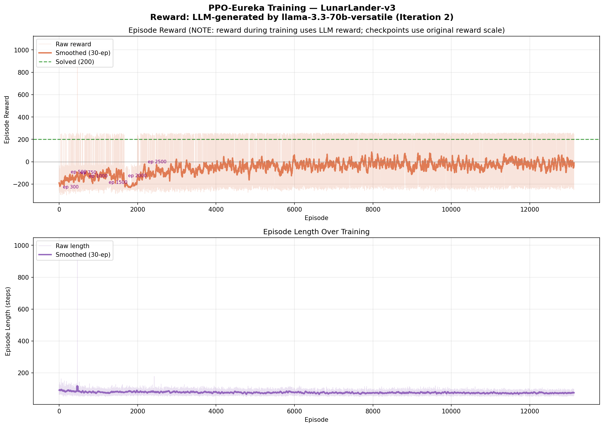
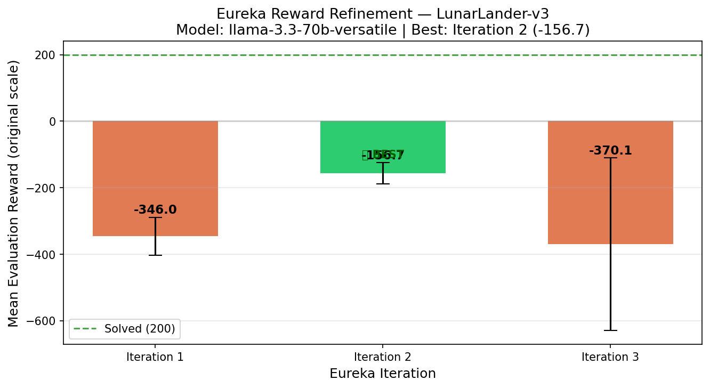

# Eureka: LLM-Driven Reward Design for Reinforcement Learning

> A practical demonstration of the **[Eureka paper](https://arxiv.org/abs/2310.12931)** (Ma et al., 2023) — using Large Language Models to automatically write reward functions for RL agents, compared against a human-designed baseline on `LunarLander-v3`.

---

## What Is Eureka?

The Eureka paper proposes replacing hand-crafted reward functions with reward functions **written by LLMs**. The core idea:

1. Give the LLM the environment's source code as context
2. Ask it to write a `compute_reward()` function
3. Run a short training loop to evaluate the reward quality
4. Feed the results back to the LLM for iterative refinement

This repo implements that loop and compares three approaches:

| Method | Reward Source | LLM Used |
|--------|--------------|----------|
| **PPO Baseline** | Handcrafted (default LunarLander reward) | — |
| **PPO + Eureka (Claude)** | LLM-generated | Claude Sonnet 4.6 |
| **PPO + Eureka (Grok)** | LLM-generated | llama-3.3-70b-versatile via Groq |

---

## Final Agent Behaviour (Trained Policies)

These GIFs show each agent at the **end of training** (1M timesteps):

<table>
<tr>
  <th align="center">PPO Baseline<br><sub>Handcrafted Reward</sub></th>
  <th align="center">PPO + Eureka (Claude)<br><sub>Claude Sonnet 4.6</sub></th>
  <th align="center">PPO + Eureka (Grok)<br><sub>llama-3.3-70b-versatile</sub></th>
</tr>
<tr>
  <td align="center"></td>
  <td align="center"></td>
  <td align="center"></td>
</tr>
<tr>
  <td align="center">✅ <b>Solved</b> — Mean: <b>242.66</b></td>
  <td align="center">⚠️ <b>Not Solved</b> — Mean: <b>137.84</b></td>
  <td align="center">❌ <b>Not Solved</b> — Mean: <b>−125.57</b></td>
</tr>
</table>

> LunarLander is considered **solved** when mean reward ≥ 200 over 100 consecutive episodes.

---

## Results

### Performance Summary

| Method | Mean Reward | Std Dev | Episodes | Solved? |
|--------|-------------|---------|----------|---------|
| PPO Baseline | **242.66** | ±48.88 | 2,734 | ✅ Yes |
| PPO + Eureka (Claude) | 137.84 | ±78.28 | 1,867 | ❌ No |
| PPO + Eureka (Grok) | −125.57 | ±11.43 | 13,128 | ❌ No |

*All methods trained for 1,000,000 timesteps. Evaluation over 20 episodes.*

### Training Curves

<table>
<tr>
  <th align="center">PPO Baseline</th>
  <th align="center">PPO + Eureka (Claude)</th>
</tr>
<tr>
  <td></td>
  <td></td>
</tr>
</table>

<table>
<tr>
  <th align="center">PPO + Eureka (Grok)</th>
  <th align="center">Grok — Eureka Iteration Progress</th>
</tr>
<tr>
  <td></td>
  <td></td>
</tr>
</table>

### Key Observations

- **PPO Baseline** solves the environment cleanly — the handcrafted reward is well-tuned for LunarLander.
- **Claude** makes progress and reaches respectable rewards but doesn't cross the solve threshold in 1M steps. The LLM-generated reward is viable but sub-optimal.
- **Grok (llama-3.3-70b)** struggles throughout — the reward function quality is poor, leading to erratic behaviour and no meaningful learning signal. This illustrates that Eureka's performance is highly dependent on the LLM quality.

---

## Interactive Visualisation

Open **`index.html`** in your browser for a fully interactive dashboard with:
- Synchronized GIF playback of all 3 final agents
- 6 interactive Plotly charts (individual training curves, comparison plots, final performance)

> **Note:** Because GIFs are loaded via `fetch()`, you need to serve the files over HTTP rather than opening the HTML directly as a file. Run this in the repo root:
> ```bash
> npx serve .
> # then open http://localhost:3000
> ```

---

## How to Run

All notebooks are designed for **Google Colab** — dependencies are installed inside the notebooks, so you don't need to set up a local environment.

### Notebook 1 — PPO Baseline (No API key needed)

[](https://colab.research.google.com/github/)

**`notebooks/PPO_LunarLander_Training_v2.ipynb`**

Trains a standard PPO agent with LunarLander's default handcrafted reward. No API keys required.

```
Run all cells top-to-bottom. Training takes ~20–40 min on Colab (CPU) or ~10 min (GPU).
```

---

### Notebook 2 — PPO + Eureka via Claude Sonnet 4.6

[](https://colab.research.google.com/github/)

**`notebooks/PPO_Eureka_LunarLander_Training_v2_Sonnet_4_6.ipynb`**

Implements the Eureka loop using Claude Sonnet 4.6. Requires an **Anthropic API key**.

**Setup:**
1. Get a free API key at [console.anthropic.com](https://console.anthropic.com)
2. When prompted in the notebook, paste your key
3. The Eureka loop makes ~3–5 API calls total — cost is negligible (< $0.05)

---

### Notebook 3 — PPO + Eureka via Grok (llama-3.3-70b)

[](https://colab.research.google.com/github/)

**`notebooks/PPO_Eureka_LunarLander_Training_v2_Grok.ipynb`**

Implements the Eureka loop using `llama-3.3-70b-versatile` through the Groq API. Requires a **Groq API key**.

**Setup:**
1. Get a free API key at [groq.com](https://groq.com) (free tier available)
2. When prompted in the notebook, paste your key
3. The Eureka loop makes ~3–5 API calls total — free tier is more than sufficient

---

### Colab Tips

- Use **Runtime → Change runtime type → T4 GPU** for faster training
- All dependencies (stable-baselines3, gymnasium, etc.) are installed by the first cell
- Results (GIFs, models, metrics) are saved to your Colab session storage — download them before the session expires or mount Google Drive

---

## Repo Structure

```
RL-Assignment/
│
├── notebooks/
│   ├── PPO_LunarLander_Training_v2.ipynb              # Baseline: handcrafted reward
│   ├── PPO_Eureka_LunarLander_Training_v2_Sonnet_4_6.ipynb  # Eureka via Claude
│   └── PPO_Eureka_LunarLander_Training_v2_Grok.ipynb       # Eureka via Grok
│
├── results/
│   ├── ppo_baseline/
│   │   ├── gifs/        # Agent snapshots at checkpoints + ppo_final.gif
│   │   ├── metrics/     # ppo_metrics.json  (full episode reward/length history)
│   │   ├── models/      # Checkpoint .zip files
│   │   └── plots/       # Training curve PNG
│   │
│   ├── ppo_eureka_claude/
│   │   ├── gifs/
│   │   ├── metrics/
│   │   ├── models/
│   │   └── plots/
│   │
│   └── ppo_eureka_grok/
│       ├── gifs/
│       ├── metrics/
│       ├── models/
│       ├── plots/
│       └── reward_functions/   # best.py + iteration_01/02/03.py (LLM-generated)
│
└── index.html    # Interactive dashboard (GIF comparator + 6 Plotly charts)
```

---

## How Eureka Works (Implementation Detail)

```
┌─────────────────────────────────────────────────────────┐
│                    EUREKA LOOP                          │
│                                                         │
│  1. Feed LLM:  environment source code + task desc      │
│  2. LLM outputs: compute_reward(obs, info) function     │
│  3. Train PPO for N timesteps with that reward          │
│  4. Evaluate: collect mean reward over K episodes       │
│  5. Feed back: training stats → LLM for refinement      │
│  6. Repeat for I iterations, keep best reward fn        │
│  7. Final train: full 1M steps with best reward         │
└─────────────────────────────────────────────────────────┘
```

In this implementation:
- **3 Eureka iterations** per run (each evaluates for 80,000 timesteps / 20 episodes)
- The best reward function (by mean eval reward) is selected for full training
- The generated reward functions are saved under `results/ppo_eureka_grok/reward_functions/`

---

## References

- **Eureka Paper:** Ma, Y. J., et al. (2023). *Eureka: Human-Level Reward Design via Coding Large Language Models.* [arxiv.org/abs/2310.12931](https://arxiv.org/abs/2310.12931)
- **Environment:** [LunarLander-v3](https://gymnasium.farama.org/environments/box2d/lunar_lander/) — Gymnasium
- **RL Library:** [Stable-Baselines3](https://stable-baselines3.readthedocs.io/) — PPO implementation
- **Models:** Claude Sonnet 4.6 (Anthropic) · llama-3.3-70b-versatile (Meta via Groq)
